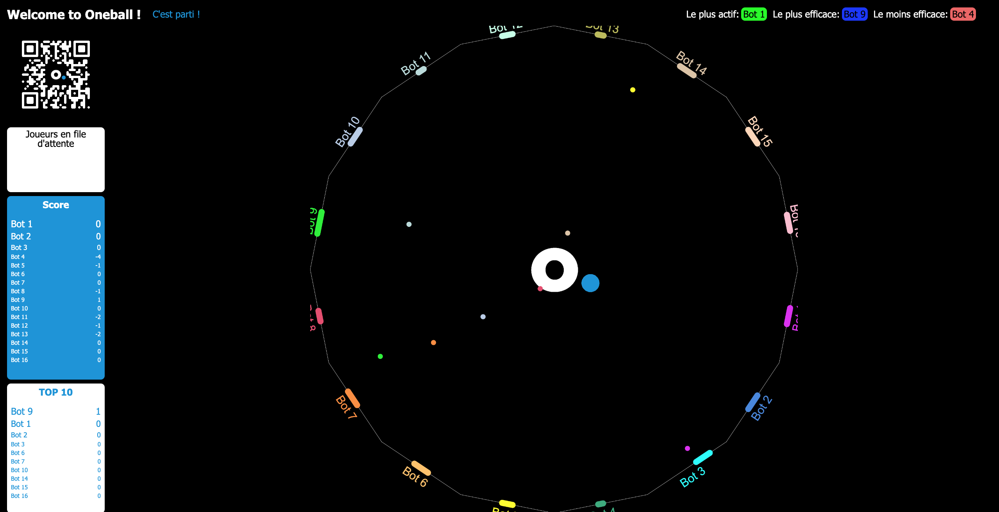

# oneball — Pong multijoueur

<!-- Badges -->
[](./)
[](LICENSE)
[](CONTRIBUTING.md)
[](./)



## Résumé

oneball est un jeu de type Pong multijoueur en temps réel. Plusieurs joueurs peuvent s'affronter en renvoyant une balle avec des raquettes pour marquer des points. Le projet vise la simplicité, la réactivité et la facilité d'extension (IA, power-ups, spectateurs).

## Fonctionnalités principales

- Parties multijoueurs en temps réel
- Architecture client / serveur (WebSocket)
- Interface légère pour joueur et affichage côté serveur
- Déploiement possible avec Docker / Kubernetes (fichiers dans `deploy/`)

## Aperçu technique

- Langage principal : TypeScript / JavaScript
- Structure du dépôt :
  - `src/` : logique du jeu (balles, physique basique, gestion de parties)
  - `browser/` : code du client (composants pour player et display)
  - `server/` : affichages et services côté serveur
  - `static/` : pages HTML/CSS et bundles JS produits
  - `deploy/` : manifests et scripts pour déploiement (Kubernetes)
- Communication temps réel : WebSocket (voir `wss.ts`, `browser/common/ws.ts`)
- Bundling / build : Webpack + TypeScript configurés pour les sous-projets (`player/`, `server/`)

## Installation et exécution (rapide)

Les commandes ci‑dessous sont des exemples courants ; vérifiez les scripts disponibles dans les `package.json` du projet et des sous-dossiers (`player/`, `server/`) avant d'exécuter.

1) Installer les dépendances à la racine :

```bash
npm install
```

2) Construire les bundles (si des scripts `build` existent) :

```bash
npm run build
# ou, si vous utilisez les sous-projets
cd player && npm install && npm run build
cd ../server && npm install && npm run build
```

3) Lancer le projet (exemples) :

```bash
# Exemple genérique : vérifiez `package.json` pour les scripts exacts
npm start
```

Note : le dépôt contient des `package.json` séparés dans `player/` et `server/` — adaptez les commandes à votre flux de travail.

## Dépannage rapide

- Le serveur ne démarre pas : vérifiez les logs, la variable d'environnement `PORT` et que les paquets sont installés.
- Le client ne trouve pas les assets : confirmez que `static/` ou le bundle Webpack est correctement généré et servi.
- Problèmes WebSocket : vérifier l'URL de connexion et les règles CORS / proxy.

## Fichiers et points d'entrée utiles

- `src/index.ts` — point d'entrée logique de l'application (jeu)
- `server/index.ts`, `player/index.ts` — points d'entrée des sous-projets
- `browser/common/ws.ts` — utilitaire WebSocket partagé
- `deploy/` — manifests Kubernetes et scripts de déploiement

## Roadmap & idées

- Matchmaking et files d'attente améliorées
- Power-ups, skins et personnalisation
- Interface mobile responsives

## Licence

Le projet est distribué sous licence MIT. Voir le fichier `LICENSE` à la racine pour le texte complet.

## Contact

Pour signaler un bug, proposer une fonctionnalité ou poser une question : ouvrez une issue sur le dépôt.

Merci d'avoir regardé oneball — amusez-vous bien et contributions bienvenues !
